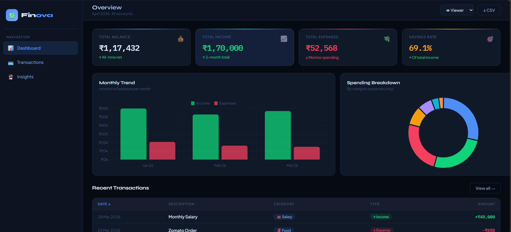
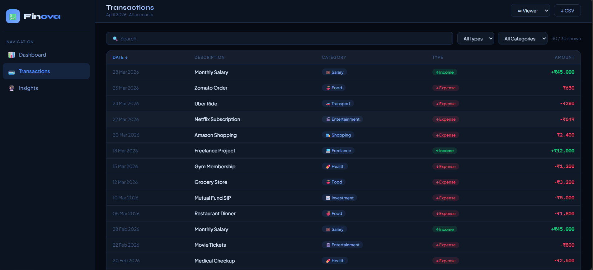
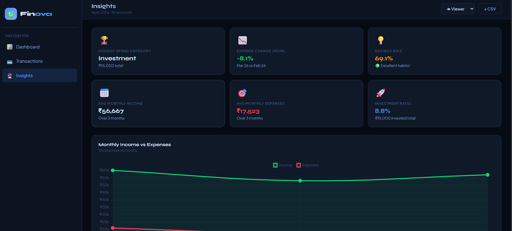

# 💹 Finova — Finance Dashboard UI

A clean, interactive finance dashboard built as part of a **Frontend Developer Intern** assignment. The app allows users to track financial activity, explore transactions, and understand spending patterns — all in a single HTML file with no backend required.

---

## 🚀 Live Demo

🔗 https://sparkling-shortbread-2e2cfc.netlify.app/
---

## 🛠️ Setup Instructions

### Prerequisites
- [Node.js](https://nodejs.org/) (v16 or above)
- [VS Code](https://code.visualstudio.com/) (recommended)

### Steps

```bash
# 1. Clone the repository
git clone https://github.com/shrey-111/Finance_Dashboard
# 2. Navigate into the project folder
cd finance-dashboard

# 3. Install dependencies
npm install

# 4. Start the development server
npm run dev
```


### Build for Production

```bash
npm run build
npm run preview
```

---

## 📁 Project Structure

```
finance-dashboard/
├── index.html       # Complete app (HTML + CSS + JS in one file)
├── package.json     # Project config and scripts
└── README.md        # Project documentation
```

> The entire application lives in a single `index.html` file — no frameworks, no build dependencies beyond a dev server.

---

## 🧠 Approach & Design Decisions

### Architecture
The app is built with **vanilla JavaScript** using a centralized `state` object to manage all application state — active view, filters, sort order, and selected role. Every state change triggers a `render()` call that re-draws the relevant section, similar to how React works but without the library overhead.

### Data Layer
- Mock transaction data is seeded on first load
- All changes (add, edit, delete) are persisted to **localStorage** so data survives page refresh
- Data flows one way: `state → render → DOM`

### Styling
- Pure CSS with **CSS variables** for consistent theming
- Dark theme with a blue accent palette
- **Syne** (display) + **IBM Plex Mono** (numbers) + **Plus Jakarta Sans** (body) for typography
- Fully responsive with CSS Grid — works on desktop, tablet, and mobile

### Charts
- Powered by **Chart.js** (loaded via CDN)
- Bar chart for monthly income vs expenses trend
- Doughnut chart for category spending breakdown
- Line chart in Insights for month-over-month comparison

---

## ✨ Features

### 1. Dashboard Overview
- **4 Summary Cards** — Total Balance, Total Income, Total Expenses, Savings Rate
- **Monthly Bar Chart** — Income vs Expenses across all months
- **Donut Chart** — Spending breakdown by category
- **Recent Transactions** — Last 5 transactions at a glance

### 2. Transactions Section
- Full transaction list with **Date, Description, Category, Type, Amount**
- **Search** — filter by description or category keyword
- **Filter by Type** — All / Income / Expense
- **Filter by Category** — dropdown with all unique categories
- **Sortable Columns** — click any column header to sort ascending/descending
- Live count showing filtered vs total transactions

### 3. Role-Based UI (Simulated RBAC)
- **Viewer Role** — can view all data, charts, and insights; no edit access
- **Admin Role** — gets Edit (✏️) and Delete (🗑️) buttons per transaction, plus the Add Transaction button
- Switch roles using the dropdown in the top bar — UI updates instantly
- Role indicator in the sidebar shows current role with a color-coded dot

### 4. Insights Section
- **Highest Spending Category** with total amount
- **Month-over-Month Expense Change** (% increase or decrease)
- **Savings Rate** with health indicator (Excellent / Room to improve / Save more)
- **Average Monthly Income & Expenses**
- **Investment Ratio** — percentage of income going into investments
- **Category Progress Bars** — visual breakdown of where money goes

### 5. State Management
- Centralized `state` object manages: active view, filter settings, sort config, selected role, modal edit ID
- No external library — plain JavaScript with function-based rendering

### 6. Optional Enhancements Implemented
| Feature | Status |
|---|---|
| Data persistence (localStorage) | ✅ |
| Export to CSV | ✅ |
| Animations & transitions | ✅ |
| Responsive design | ✅ |
| Add / Edit / Delete transactions | ✅ |
| Advanced filtering & sorting | ✅ |

---

## 📸 Screenshots

| Dashboard | Transactions | Insights |
|---|---|---|
|  |  |  |

---

## 🧰 Tech Stack

| Technology | Usage |
|---|---|
| HTML5 | Structure |
| CSS3 | Styling, animations, layout |
| Vanilla JavaScript | Logic, state, rendering |
| Chart.js | Data visualizations |
| Netlify | Development & Hosting |
| localStorage | Data persistence |

---

## 👩‍💻 Author

**Shreya**
- GitHub: https://github.com/shrey-111
- LinkedIn: https://www.linkedin.com/in/shreya417592236/
